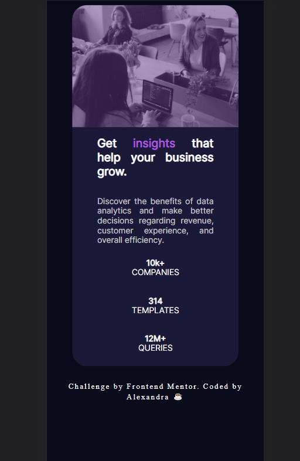

# Frontend Mentor - Stats preview card component solution

This is a solution to the [Stats preview card component challenge on Frontend Mentor](https://www.frontendmentor.io/challenges/stats-preview-card-component-8JqbgoU62). Frontend Mentor challenges help you improve your coding skills by building realistic projects.

## Table of contents

- [Overview](#overview)
  - [The challenge](#the-challenge)
  - [Screenshot](#screenshot)
  - [Links](#links)
- [My process](#my-process)
  - [Built with](#built-with)
  - [What I learned](#what-i-learned)
  - [Useful resources](#useful-resources)
- [Author](#author)

## Overview

### The challenge

Users should be able to:

- View the optimal layout depending on their device's screen size

### Screenshot

### Links

- Solution URL: [Github Repository](https://github.com/AlexandraMol/preview_card_challenge)
- Live Site URL: [Github Pages](https://alexandramol.github.io/preview_card_challenge/)

## My process

### Built with

- Semantic HTML5 markup
- CSS custom properties
- Flexbox

### What I learned

This challenge helped me understand CSS properties better. Also, it was a good opportunity for me to exercise on building the Mobile Version of a component.

### Useful resources

- [Flexbox guide](https://css-tricks.com/snippets/css/a-guide-to-flexbox/) - This helped me with understanding how flexbox works. I'd recommend it to anyone still learning this concept.

## Author

- Frontend Mentor - [@AlexandraMol](https://www.frontendmentor.io/profile/AlexandraMol)
